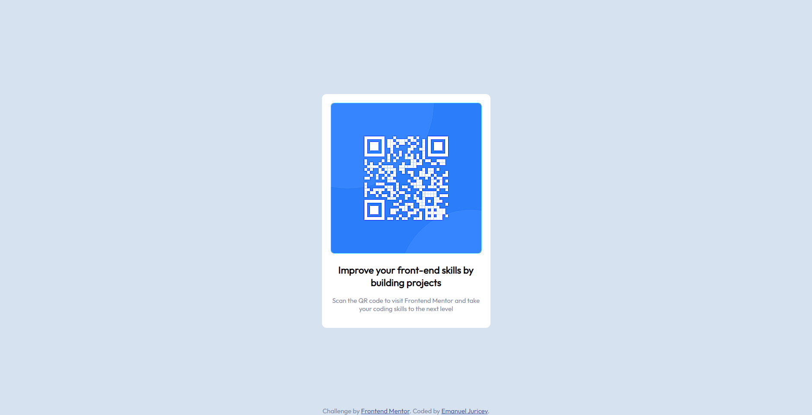

# Frontend Mentor - QR code component solution

This is a solution to the [QR code component challenge on Frontend Mentor](https://www.frontendmentor.io/challenges/qr-code-component-iux_sIO_H). Frontend Mentor challenges help you improve your coding skills by building realistic projects.

## Table of contents

- [Overview](#overview)
  - [Screenshot](#screenshot)
  - [Links](#links)
- [My process](#my-process)
  - [Built with](#built-with)
  - [What I learned](#what-i-learned)
  - [Continued development](#continued-development)
  - [Useful resources](#useful-resources)
- [Author](#author)

## Overview

### Screenshot

### Links

- Solution URL: [Solution URL](https://github.com/EmanuelJrc/qr-code-website)
- Live Site URL: [Live site URL](https://emanueljrc.github.io/qr-code-website/)

## My process

### Built with

- HTML5
- CSS custom properties
- Flexbox
- CSS Grid
- Mobile-first workflow

### Useful resources

- [Google Fonts Docs](https://developers.google.com/fonts/docs/getting_started) - This helped me to add fonts to the site

## Author

- Website - [Emanuel Juricev Homepage](https://emanuel-homepage-seven.vercel.app)
- Frontend Mentor - [@EmanuelJrc](https://www.frontendmentor.io/profile/EmanuelJrc)
- Twitter - [@emanuel\_\_jrc](https://www.twitter.com/emanuel__jrc)
